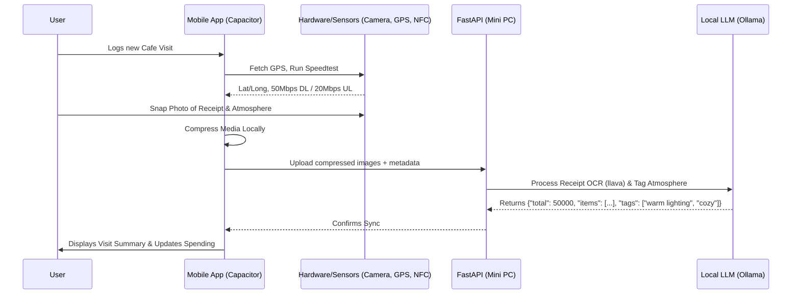
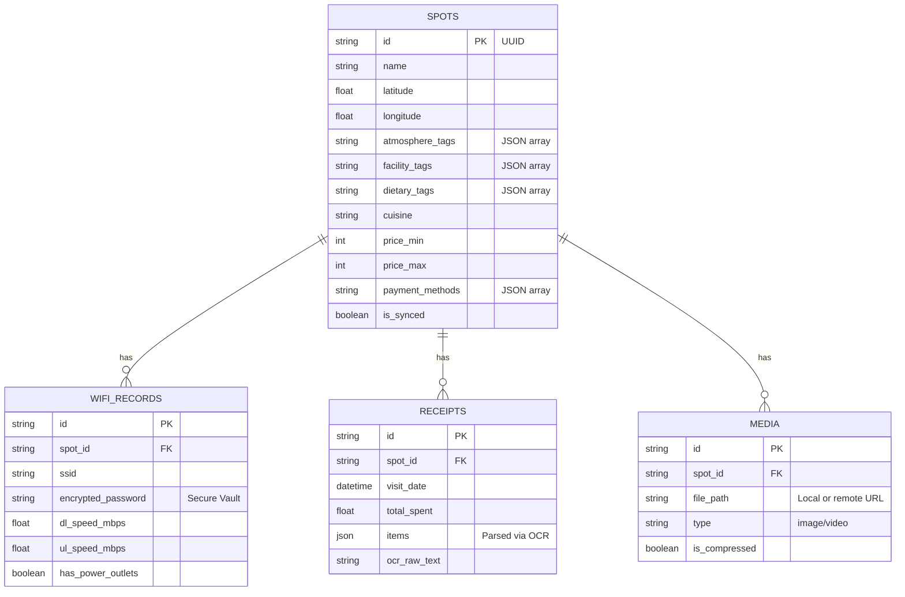

# 📍 Hybrid AI Assistant: Project Specifications

## Table of Contents

1. [Functional Specification Document (FSD)](#1-functional-specification-document-fsd)
   * 1.1 Project Overview & Purpose
   * 1.2 Target Audience
   * 1.3 Core Functional Requirements
   * 1.4 User Stories & Workflows
   * 1.5 System Behavior & Error Handling
2. [Technical Specification Document (TSD)](#2-technical-specification-document-tsd)
   * 2.1 System Architecture
   * 2.2 Technology Stack
   * 2.3 System Flow Diagram
   * 2.4 Database Design & Schemas
     * 2.4.1 Relational Database Schema (SQLite/PostgreSQL)
     * 2.4.2 Vector Database Schema (ChromaDB)
   * 2.5 API Specifications
3. [Development Plan & Module Separation](#3-development-plan--module-separation)
   * 3.1 Module Breakdown
   * 3.2 Phased Development Plan
4. [UI & UX Design Strategy](#4-ui--ux-design-strategy)
   * 4.1 Hybrid Design Philosophy
   * 4.2 Component Library Strategy
   * 4.3 Responsive Navigation Patterns
   * 4.4 WebView Performance Optimization

---

## 1. Functional Specification Document (FSD)

### 1.1 Project Overview & Purpose
The "Local-First AI Assistant" is a hybrid mobile and web application designed to act as a comprehensive hyper-local guide and personal workspace tracker. It provides context-aware spot recommendations by synthesizing real-time GPS, private user preferences, and local AI search. Beyond recommendations, the app serves as a detailed logging tool—tracking WiFi speeds, secure passwords, atmosphere aesthetics via image processing, facility amenities, dietary options, and automated financial tracking via receipt OCR scanning. Heavy reasoning is processed by a local LLM running on a Mini PC, ensuring 100% privacy and zero subscription costs.

### 1.2 Target Audience
* The primary user (Self-hosted environment, remote workers, cosplayers, cafe-hoppers).
* Friends or community members who can receive recommendations offline via NFC sharing.

### 1.3 Core Functional Requirements
* **FR1. Location & Smart Mapping:** Retrieve user's GPS coordinates. Redirect to native Map apps on mobile (Google Maps/Apple Maps) or Google Maps web on desktop. Filter and sort spots by distance and price.
* **FR2. Intelligent Discovery & Hybrid RAG:** Search for spots based on abstract atmosphere descriptions (e.g., "cozy and bright afternoon") using AI image processing, metadata, local ChromaDB notes, and live web data.
* **FR3. Connectivity & Tech Tracking:** Integrate a Speedtest API (JS-based) to record latency/speeds. Provide a secure, encrypted local vault for WiFi passwords. Track power outlet availability.
* **FR4. Atmosphere & Facilities Logging:** Tag locations with atmosphere ("Spacious", "Warm tone lighting", "Outdoor/Indoor", "Smoking/Non-smoking"), leisure facilities (Board games), and suitability (Pet-friendly, Kids-friendly).
* **FR5. Menu & Dining Metadata:** Log minimum/maximum price ranges, dietary markers (Halal/Non-halal, Vegan-friendly), cuisines (Asian, Western, Indonesian), and portion sizes.
* **FR6. Transactions & Receipt Scanner:** Log accepted payment methods (QRIS, Debit, CC, Cash). Use local OCR (Llava vision model) to scan receipts, save order history, and summarize spending per spot.
* **FR7. Media & UX:** Support Light/Dark mode and Localization (e.g., EN/ID). Compress photos/videos locally before storage to save space.
* **FR8. Offline Storage & Sync:** Save all notes, media, and metadata offline via SQLite, syncing manually/automatically to the Mini PC server.
* **FR9. NFC Sharing:** Encode recommendations, WiFi details (optional), and deep links into an NDEF message for tap-to-share.

### 1.4 User Stories & Workflows
* **Story A (Discovery):** *As a user, I want to search for a "cozy and bright afternoon" spot so I can take good photos while working.*
  * **Input:** Search query "cozy and bright afternoon".
  * **Action:** AI searches ChromaDB embeddings and image metadata to find locations matching the aesthetic vibe.
* **Story B (Tech & Receipt Logging):** *As a user, I want to log my work session so I remember the WiFi speed and what I spent.*
  * **Input:** User runs in-app speed test and takes a photo of their receipt.
  * **Action:** App logs DL/UL speed. Local AI OCR scans the receipt, extracts the total spent, lists the items, and saves compressed image media.
* **Story C (NFC Share):** *As a user, I want to share a cafe with a friend so we can meet up.*
  * **Input:** User taps "Share via NFC".
  * **Action:** App writes an NDEF URI. Friend's phone opens the app showing the cafe location, amenities, and dietary tags.

### 1.5 System Behavior & Error Handling
* **No Internet:** Switches to "Local Device Mode." Network test is disabled, OCR queues the image for later processing, and search relies solely on SQLite.
* **GPS Denied:** Prompts manual neighborhood entry.
* **OCR Failure:** If the receipt is illegible, the app prompts the user for manual entry of the total spent.

---

## 2. Technical Specification Document (TSD)

### 2.1 System Architecture
The application uses a **Distributed Hybrid Architecture**.
* **Client Layer:** Capacitor app (SvelteKit/React). Handles UI, local SQLite, secure vaults, image compression, and hardware APIs (NFC, GPS, Camera).
* **Controller/Middleware Layer:** FastAPI server running on a ThinkCentre Mini PC.
* **Data Layer:** SQLite (Mobile offline cache), ChromaDB (Mini PC vector storage for intelligent search), standard relational DB (PostgreSQL/SQLite on Mini PC for structured data like receipts).
* **Inference Layer:** Local Ollama (`nomic-embed-text` for tags/search, `llava` for Vision OCR, and `deepseek-r1:7b` for text generation).

### 2.2 Technology Stack
* **Frontend:** SvelteKit (or React), Capacitor JS, TailwindCSS.
* **Plugins:** `@capacitor/geolocation`, `@capacitor-community/sqlite`, `@capawesome-team/capacitor-nfc`, Capacitor Camera/Filesystem.
* **Backend:** Python 3.11+, FastAPI, Uvicorn.
* **Databases:** ChromaDB, SQLite/PostgreSQL, Capacitor SQLite.
* **AI/ML (100% Local):** Ollama, DuckDuckGo Search API (Python lib).
* **Networking:** Localtunnel or Tailscale.

### 2.3 System Flow Diagram

### 2.4 Database Design & Schemas

#### 2.4.1 Relational Database Schema (SQLite/PostgreSQL)
This schema handles the exact, structured logging of your cafe visits.

#### 2.4.2 Vector Database Schema (ChromaDB)
ChromaDB uses **Collections** of embedded text for the "Intelligent Discovery" feature.

**Collection 1: `spots_semantic_index`**
* **`id`**: `spot_id`
* **`document`**: Synthesized text (e.g., *"Matcha Library Cafe. Atmosphere is cozy, warm tone lighting, spacious, indoor. Facilities include board games, pet-friendly. Cuisine is Asian, Halal. Price range 50k-100k."*)
* **`embedding`**: Generated by Ollama `nomic-embed-text`.
* **`metadata`**: `{"name": "Matcha Library Cafe", "latitude": -6.2020, "longitude": 106.8150, "is_halal": true, "has_wifi": true}`

**Collection 2: `user_memories_index`**
* **`id`**: `memory_id`
* **`document`**: Raw text notes (e.g., *"The matcha latte here is amazing but the music was too loud. Good WiFi."*)
* **`embedding`**: Generated by Ollama.
* **`metadata`**: `{"spot_id": "uuid-of-cafe", "timestamp": "2026-05-03T14:30:00Z", "source": "user_note"}`

### 2.5 API Specifications (FastAPI)
* **POST `/api/recommend`**
    * *Payload:* `{"lat": -6.2, "long": 106.8, "query": "cozy and bright afternoon, halal"}`
    * *Response:* Matched spots filtering by dietary constraints and semantic vector search on atmosphere tags.
* **POST `/api/process-receipt`**
    * *Payload:* `{"image_base64": "..."}`
    * *Response:* `{"total": 125000, "items": ["Matcha Latte", "Croissant"], "payment_detected": "QRIS"}`
* **POST `/api/sync`**
    * *Payload:* Nested JSON of Spots, WiFi Records, Receipts, and Media metadata.

---

## 3. Development Plan & Module Separation

### 3.1 Module Breakdown
1. **Core UI & Data Module:** Layouts, Light/Dark themes, local SQLite CRUD operations.
2. **Environment & Hardware Module:** GPS fetching, Capacitor Camera, local media compression, Map redirection.
3. **Connectivity & Tech Module:** JS Speedtest integration, secure encrypted storage vault for WiFi passwords.
4. **AI & Intelligence Module:** FastAPI backend, ChromaDB, local Ollama Vision LLM for OCR and tagging.
5. **Logistics & Sharing Module:** NFC NDEF encoding/decoding, advanced sorting algorithms, spending dashboards.

### 3.2 Phased Development Plan
* **Phase 1: Foundation (Weeks 1-2):** Initialize SvelteKit/React project and Capacitor wrap. Set up Capacitor SQLite. Build basic UI to add a "Spot".
* **Phase 2: Sensors & Connectivity (Weeks 3-4):** Integrate Geolocation. Build Connectivity Module (JS Speedtest, WiFi password vault). Implement sorting logic.
* **Phase 3: The Local AI Brain (Weeks 5-6):** Set up FastAPI server and Ollama (`llava`) on the Mini PC. Build the mobile flow: Take a picture -> Compress -> Upload -> Receive OCR parsed JSON -> Save.
* **Phase 4: Intelligent Discovery (Weeks 7-8):** Integrate ChromaDB on the backend. Create scripts to generate text embeddings. Build the "Intelligent Search" UI.
* **Phase 5: Polish & Social (Week 9):** Implement the NFC Sharing module to turn a Spot into a shareable deep-link URL. Final QA.

---

## 4. UI & UX Design Strategy

### 4.1 Hybrid Design Philosophy
* **Mobile-First Approach:** The layout prioritizes one-handed mobile use first, scaling up gracefully to multi-column layouts on desktop.
* **App-Like Feel on Web:** Utilize CSS properties like `user-select: none`, `-webkit-tap-highlight-color: transparent`, and `overscroll-behavior: none`.

### 4.2 Component Library Strategy
Use **Tailwind CSS** combined with an unstyled/headless component library (e.g., **shadcn-svelte** or **shadcn/ui**). It provides accessible, highly customizable components that seamlessly support Light/Dark mode.

### 4.3 Responsive Navigation Patterns
* **Mobile:** Use a **Bottom Navigation Bar** for core modules. Use **Bottom Sheets** for complex forms.
* **Desktop:** The Bottom Navigation transforms into a **Left Sidebar Menu**.

### 4.4 WebView Performance Optimization
* **Skeleton Loaders:** Use skeleton loaders for the "Intelligent Discovery" AI results to reduce perceived latency.
* **Touch Targets:** All interactive elements must have a minimum touch target size of `44x44px`.
* **Hardware Acceleration:** Use `transform` and `opacity` for UI animations to ensure smooth 60fps performance on mobile GPUs.